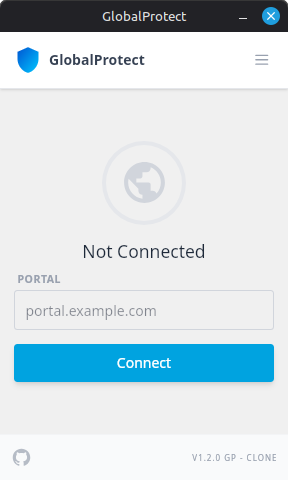

# GlobalProtect Client for Linux 🛡️

A modern, fast, and sleek GlobalProtect VPN client built with **Tauri**, **React**, and **OpenConnect**. Designed specifically for Linux users who want a native-feeling experience with a system tray indicator and seamless credential management.

<p align="center">
  
</p>


## Key Features ✨

-   **Zero-Password Connection**: No root password prompt every time you connect (via automated security policy).
-   **System Tray Integration**: Live connection status (Connected ✅ / Disconnected ❌) directly in your panel.
-   **Smart Auto-Connect**: Automatically connects if credentials are saved.
-   **Modern UI**: Sleek, compact design (width 288px) that looks great on any desktop.
-   **Credential Management**: Safely store and manage your portal, username, and password in Settings.
-   **Multi-Distro Support**: Available in `.deb` (Debian/Ubuntu) and `.rpm` (Fedora/RHEL) formats.

## Installation 🚀

### Debian / Ubuntu / Linux Mint / Kali
1. Download the latest `.deb` package from the [Releases](https://github.com/EPX-PANCA/globalprotect-client-linux/releases) page.
2. Install it using `apt` to automatically fetch dependencies:
    ```bash
    sudo apt install ./GlobalProtect_1.2.0_amd64.deb
    ```

### Fedora / RHEL / CentOS
1. Download the latest `.rpm` package from the [Releases](https://github.com/EPX-PANCA/globalprotect-client-linux/releases) page.
2. Install it using `dnf`:
    ```bash
    sudo dnf install ./GlobalProtect-1.2.0-1.x86_64.rpm
    ```

## Post-Installation Security Tip 🔑

To enable **connection without root password prompts** in development mode or if your installer didn't automatically apply the policy, run this command once:

```bash
echo "$USER ALL=(ALL) NOPASSWD: /usr/sbin/openconnect" | sudo tee /etc/sudoers.d/globalprotect
```

## Development Setup 🛠️

Requirements:
-   Node.js (v20+)
-   Rust (stable)
-   OpenConnect (`sudo apt install openconnect`)

```bash
# Clone the repository
git clone https://github.com/EPX-PANCA/globalprotect-client-linux.git

# Install dependencies
npm install

# Run in development mode
npm run tauri dev

# Build production installer
npm run tauri build
```

## Credits 🤝

Developed by **EPX-PANCA**. Powered by [Tauri](https://tauri.app/) and [OpenConnect](https://www.infradead.org/openconnect/).

---
*Disclaimer: This is an unofficial client for GlobalProtect VPN.*
