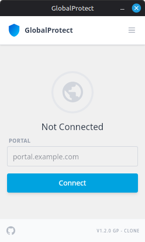

# GlobalProtect Client for Linux 🛡️

A modern, fast, and sleek GlobalProtect VPN client built with **Tauri**, **React**, and **OpenConnect**. 

Designed as a **free, open-source alternative** for the Linux community who need a reliable GlobalProtect connection without the hassle. If you've been looking for a way to connect to your corporate VPN on Linux with a native-feeling experience, smooth system tray integration, and seamless credential management — **this is your solution**.

<p align="center">
  
</p>


## Key Features ✨

-   **Connection Logs**: Real-time log viewer to monitor connection status and troubleshoot issues.
-   **Enhanced Connectivity**: Auto-reconnect logic handles network interruptions gracefully.
-   **Security Checks**: Built-in validation allows you to fix permission issues effortlessly.
-   **Zero-Password Connection**: No root password prompt every time you connect (via automated security policy).
-   **System Tray Integration**: Live connection status (Connected ✅ / Disconnected ❌) directly in your panel.
-   **Smart Auto-Connect**: Automatically connects if credentials are saved.
-   **Modern UI**: Sleek, compact design (width 288px) that looks great on any desktop.
-   **Credential Management**: Store and manage your portal, username, and password in Settings. The local config is restricted to the current user.
-   **Multi-Distro Support**: Available in `.deb` (Debian/Ubuntu) and `.rpm` (Fedora/RHEL) formats.

## Installation 🚀

### Debian / Ubuntu 24.04+ / Linux Mint / Kali
1. Download the latest `.deb` package from the [Releases](https://github.com/EPX-PANCA/globalprotect-client-linux/releases) page.
2. Install it using `apt` to automatically fetch dependencies:
    ```bash
    sudo apt install ./GlobalProtect_1.2.5_amd64.deb
    ```

### Fedora / RHEL / CentOS
1. Download the latest `.rpm` package from the [Releases](https://github.com/EPX-PANCA/globalprotect-client-linux/releases) page.
2. Install it using `dnf`:
    ```bash
    sudo dnf install ./GlobalProtect-1.2.5-1.x86_64.rpm
    ```

### AppImage (x86_64 Linux)
1. Download the `.AppImage` file.
2. Make it executable:
    ```bash
    chmod +x GlobalProtect_1.2.5_amd64.AppImage
    ```
3. Run it:
    ```bash
    ./GlobalProtect_1.2.5_amd64.AppImage
    ```
    > **Note**: Do not run the AppImage with `sudo`. Instead, follow the security tip below to allow the internal VPN process to run with privileges.
    >
    > **Compatibility**: The AppImage does not bundle OpenConnect, `vpnc-scripts`, WebKitGTK, or the restricted privilege helper. Install those runtime dependencies separately. It is primarily tested on Debian-based distributions; Fedora/RHEL users should use the native `.rpm` installer.

## Post-Installation Security Tip 🔑

Native packages install a restricted, root-owned helper for passwordless connections. For development mode, install the same helper and policy once:

```bash
sudo install -D -o root -g root -m 0755 src-tauri/globalprotect-helper /usr/libexec/globalprotect/openconnect-helper
sudo install -D -o root -g root -m 0440 src-tauri/globalprotect-sudoers /etc/sudoers.d/globalprotect
sudo visudo -cf /etc/sudoers.d/globalprotect
```

The helper is used by packaged builds so arbitrary root commands cannot be passed through OpenConnect's `--script` option. Do not broaden the production policy beyond the packaged helper.

## Development Setup 🛠️

Requirements:
-   Node.js (v20+)
-   Rust (stable)
-   OpenConnect (install `openconnect` with your distribution's package manager)

```bash
# Clone the repository
git clone https://github.com/EPX-PANCA/globalprotect-client-linux.git

# Install dependencies
npm install

# Run in development mode
npm run tauri dev

# Build production installer
npm run tauri build
```

## Credits 🤝

Developed by [EPX-PANCA](https://github.com/EPX-PANCA). Powered by [Tauri](https://tauri.app/) and [OpenConnect](https://www.infradead.org/openconnect/).

---
*v1.2.5 for Linux (x86_64 packages)*
